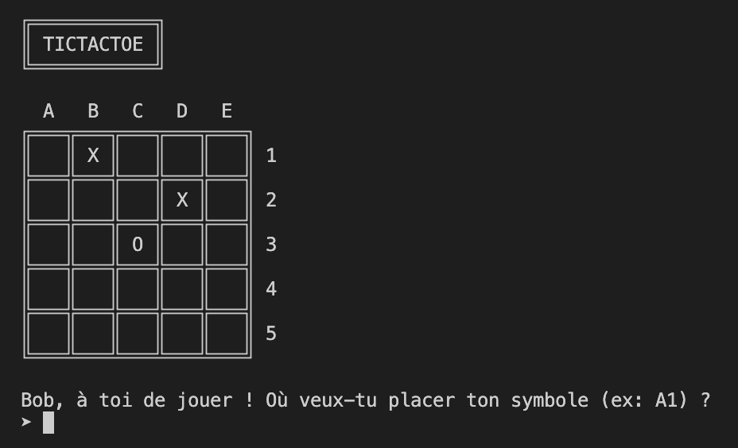
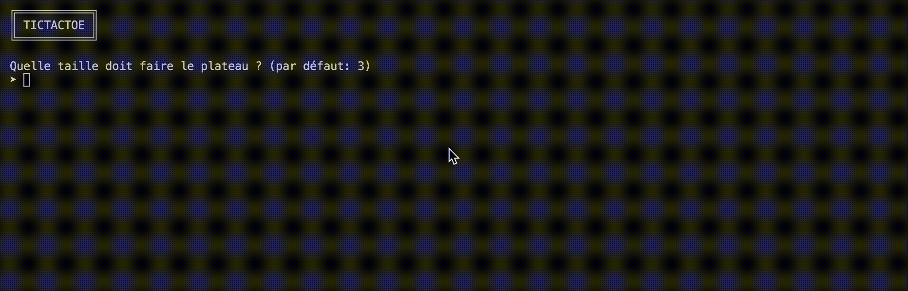
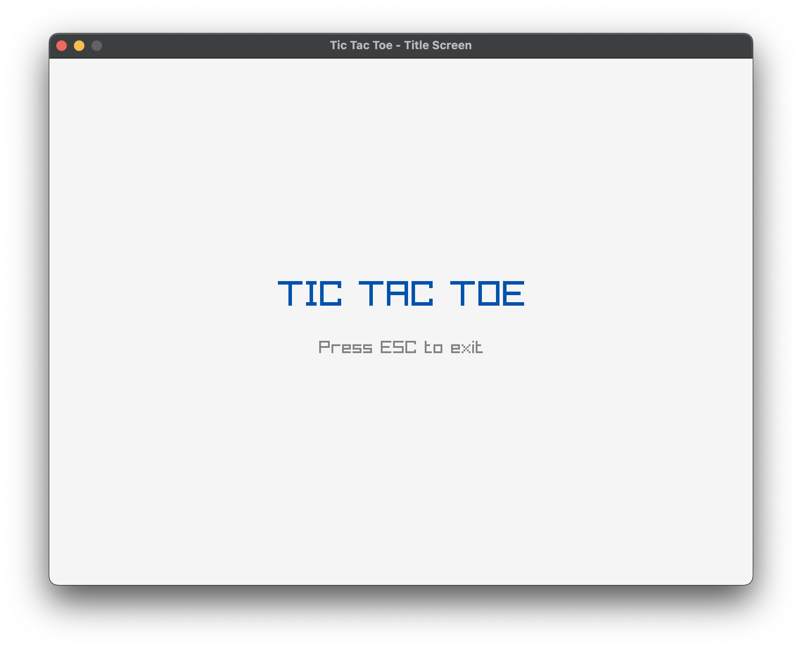

# TICTACTOE - C++

Ce programme est un jeu de morpion en C++.
Il utilise la librairie standard de C++ et la librairie [terminal-ctrl](https://github.com/dsmtE/terminal_ctrl/tree/main) pour vider le terminal simplement (peu importe l'os) et pour sleep().
Le jeu a été testé sous macOS et Linux.

## Exécution
Pour exécuter le programme, il suffit de compiler le fichier main.cpp avec un compilateur C++ (g++ par exemple) et de l'exécuter.

! Pour la branche GUI, il faut installer [Raylib](https://www.raylib.com/) pour l'affichage graphique.


## Structure
```
main.cpp        // Point d'entrée du programme
board.cpp       // Contient la struct Board qui représente le plateau de jeu
board.hpp       
player.cpp      // Contient la struct Player qui représente un joueur
player.hpp
ui.cpp          // Contient la struct UI qui gère l'affichage du jeu
ui.hpp
settings.hpp    // Contient les constantes du jeu (paramètres par défaut)
> lib
    random.cpp  // Librairie reprise du workshop qui contient des fonctions pour la génération de nombres aléatoires
    random.hpp
```

## Améliorations
- Choix de la taille du plateau

On peut choisir la taille du plateau pour jouer à un morpion de taille 3x3, 4x4, 5x5, etc.
Cela a nécessité de modifier la struct Board pour qu'elle puisse gérer une taille variable, et de modifier la struct UI pour qu'elle puisse afficher un plateau de taille variable. L'affichage d'un plateau de taille dynamique a un peu compliqué le code car j'ai utilisé un affichage en ASCII.

- Affichage amélioré

J'ai amélioré l'affichage du tableau en affichant un tableau en caractères ASCII, ce qui a été un peu complexe à mettre en place pour une taille de plateau variable. On peut également choisir d'afficher des cases plus ou moins grandes en modifiant la constante `CELL_SIZE` dans le fichier `settings.hpp`.
Ensuite, j'ai fait en sorte de clear le terminal entre chaque tour pour que le jeu soit plus lisible.

- Choix de la difficulté de l'IA
J'ai commencé par implémenter une IA facile (qui joue au hasard) comme demandé dans le sujet. Au moment de l'améliorer, j'ai ajouté une condition qui permet de choisir le niveau de difficulté de l'IA. L'IA facile joue toujours au hasard, mais l'IA difficile essaie de bloquer les mouvements du joueur et de gagner si elle en a l'occasion.

- Interface graphique (branche `gui`)

pas eu le temps de finir


## Bilan
J'ai rencontré quelques petits soucis sur l'implémentation de l'IA difficile : pour simplifier le code, j'ai réutilisé la fonction `check_if_someone_won()` de ma struct Board pour vérifier si l'IA ou le le joueur ont la possibilité de gagner au prochain coup. Je créée une copie du Board et je coche chaque case tour à tour, une fois en tant qu'IA, une fois en tant que joueur. Le principe est assez simple mais j'ai passé du temps à régler un bug là dessus : j'avais oublié de cacher la case en tant que joueur donc l'IA ne bloquait jamais les mouvements du joueur.

J'ai aussi une piste d'amélioration pour mon code. Je convertis les coordonnées entrée par le joueur (ex: A1) en coordonnées du tableau (ex: 1) via une méthode de la struct Board, et vice versa. C'est utile quand la coordonnée est envoyée par le joueur, mais c'est inutile quand c'est l'IA qui joue. J'aurais pu faire en sorte que l'IA joue directement avec les coordonnées du tableau pour éviter de faire des conversions inutiles, mais je voulais que la struct Player et la struct AIPlayer aient exactement les mêmes méthodes pour qu'elles soient totalement interchangeables.
Je pense qu'une bonne solution serait de créer une struct dédiée pour les coordonnées `struct Coordinate`, qui puisse être instanciée soit avec une coordonnée string ou avec une coordonnée "index de tableau", et qui fasse la conversion automatiquement. Cette struct pourrait même se charger de vérifier que la string entrée par le joueur est bien une coordonnée valide.